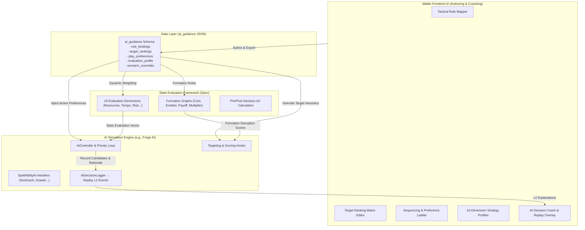
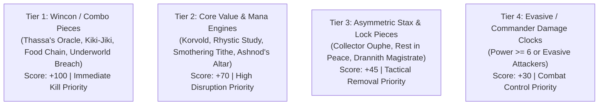
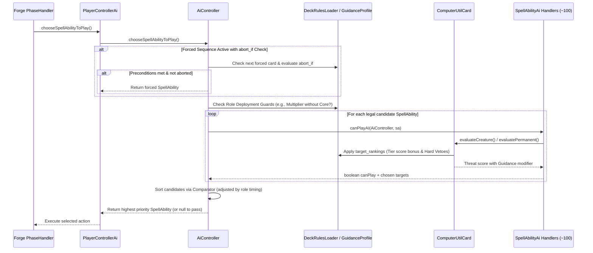
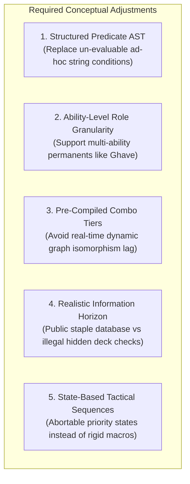
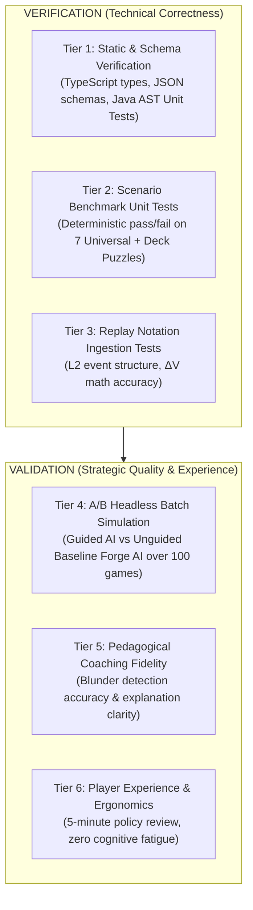

# AI Play Guidance Specification

## Companion Specification v1.0.0

**Status:** Draft / Proposed  
**Published:** August 2026  
**Purpose:** Standardized JSON format and execution model for defining deck-specific AI play policies, tactical role connections, target ranking heuristics, and sequencing preferences for Magic: The Gathering engines and frontend interfaces.

**Related Specifications:**
- [MTG Replay & Learning Notation](./MTG-REPLAY-NOTATION.md)
- [Commander Decklist Notation](./commander-decklist-spec.md)
- [MTG State Evaluation Framework](./mtg-state-evaluation-spec.md)
- [Forge Integration Guide](./forge-integration-guide.md)

---

## 0. Philosophy & Design Preamble

> **This system is not designed to be pitch-perfect.**
>
> The goal is to be **helpful and enjoyable** — to support a player's creative vision for their deck and to make the deck-building and deck lifecycle experience more rewarding. A tool that requires a PhD in game theory to configure is no tool at all. A coaching comment that sparks a new strategic insight, a scenario that helps a player understand why their engine stalled, or a single well-timed warning that prevents a blunder — these are the measures of success.
>
> The system should be **progressively useful**: immediately valuable with minimal input, and richer as the player engages more deeply. At every stage, the player remains in control. The AI is a sparring partner and co-pilot, not an oracle.

---

## 1. Introduction & Objectives

Standard game engines and AI simulators (such as Forge) evaluate plays using generic, card-agnostic heuristics (e.g., maximum mana expenditure, raw creature power/toughness, generic threat ratings). While effective for baseline gameplay, these heuristics fail to capture:

1. **Deck Strategic Intent:** Synergies, combo dependencies, and engine formation requirements.
2. **Tactical Target Valuation:** Context-sensitive threat assessment (e.g., distinguishing between a vanilla 6/6 and an opponent's core synergy engine).
3. **Sequencing & Timing Nuance:** Optimal play order within a turn, baiting countermagic, holding protection, and pre- vs. post-combat timing windows.
4. **Adaptive Strategy Profiles:** Shifting priorities across early setup, mid-game development, and late-game reach.

The **AI Play Guidance Specification** defines a declarative schema (`ai_guidance`) embedded in Commander decklists or standalone policy files, bridging the **MaMo Frontend Playbook UI**, the **Vector State Evaluation Engine**, and execution platforms such as **Forge AI**.

---

## 2. Architecture & Data Flow



---

## 3. Schema Overview: `ai_guidance`

The `ai_guidance` object is declared within `deck_rules` in a decklist file (or stored as a standalone `.policy.json` file):

```json
{
  "format": "mtg-ai-guidance",
  "version": "1.0.0",
  "meta": {
    "deck_id": "c1f7b8a2-9b24-4d8e-9d21-4f1e0d8a7c3b",
    "deck_name": "Ghave Spores & Combos",
    "author": "MaMo AI Architect",
    "updated": "2026-08-20"
  },
  "role_bindings": { /* Tactical Card Roles & Deployment Constraints */ },
  "target_rankings": [ /* Dynamic Target Prioritization & Vetoes */ ],
  "play_preferences": [ /* Sequencing Ladders, Timing Windows & Baiting */ ],
  "evaluation_profile": { /* 10-Dimension Weights across Turn Stages */ },
  "scenario_overrides": [ /* Situational Fallbacks & Board State Triggers */ ]
}
```

---

## 4. Pillar 1: Tactical Role Bindings (`role_bindings`)

Cards within a deck are assigned explicit tactical roles that determine how and when the AI should cast, activate, and protect them.

### 4.1 Role Definitions

| Role Identifier | Description | Strategic Default Behavior |
| :--- | :--- | :--- |
| `engine_core` | Central value or combo hub of the deck (e.g., *Ghave*, *Korvold*, *Ashnod's Altar*). | Do not deploy without enablers or protection; protect with highest priority. |
| `enabler` | Feeds materials (counters, tokens, sacrifice fodder, mana) into the engine. | Deploy early to prepare board state for `engine_core`. |
| `multiplier` | Amplifies engine outputs (e.g., *Doubling Season*, *Parallel Lives*, *Panharmonicon*). | Hold until at least one `engine_core` or active `enabler` is online. |
| `payoff` | Converts accumulated resources into board dominance, card draw, or win conditions. | Cast when formation output or resource pool satisfies threshold. |
| `protection` | Shields key permanents from removal or wraths (e.g., *Heroic Intervention*, *Teferi's Protection*). | Hold open mana; cast reactively in response to opponent interaction. |
| `spot_removal` | Single-target removal or bounce spells. | Consume according to `target_rankings`. |
| `board_wipe` | Symmetrical or asymmetric mass removal. | Cast only when opponent board presence outscales self board by defined ratio. |
| `battery` | Mana ramp, rocks, and dorks (e.g., *Sol Ring*, *Birds of Paradise*). | Curve accelerator; prioritize in Turns 1–3. |

### 4.2 Ability-Level Role Granularity

For multi-functional permanents (e.g., *Ghave, Guru of Spores*, *Yawgmoth, Thran Physician*, Planeswalkers), roles are declared both at the card level (primary classification) and per-ability index (1-based ability index from oracle text).

### 4.3 Schema: Role Bindings & Deployment Constraints (Structured AST)

```json
{
  "role_bindings": {
    "cards": {
      "Ghave, Guru of Spores": {
        "primary_role": "engine_core",
        "sub_roles": ["payoff", "sac_outlet"],
        "abilities": {
          "1": {
            "role": "enabler",
            "effect_type": "token_producer",
            "timing": "end_of_opponent_turn",
            "cost_profile": { "mana": "{1}", "counters_removed": 1 }
          },
          "2": {
            "role": "payoff",
            "effect_type": "sac_outlet_and_buff",
            "timing": "combat_declare_blockers",
            "cost_profile": { "mana": "{1}", "creatures_sacrificed": 1 }
          }
        }
      },
      "Ashnod's Altar": {
        "primary_role": "engine_core",
        "sub_roles": ["battery", "combo_piece"]
      },
      "Doubling Season": {
        "primary_role": "multiplier",
        "sub_roles": ["combo_piece"]
      },
      "Young Wolf": {
        "primary_role": "enabler",
        "sub_roles": ["fodder"]
      },
      "Heroic Intervention": {
        "primary_role": "protection",
        "sub_roles": ["reactive"]
      },
      "Swords to Plowshares": {
        "primary_role": "spot_removal",
        "sub_roles": ["exile"]
      }
    },
    "deployment_constraints": [
      {
        "id": "multiplier_requires_board",
        "applies_to_role": "multiplier",
        "condition": {
          "any_of": [
            { "field": "battlefield.roles", "op": "contains_any", "value": ["engine_core", "enabler"] },
            { "field": "battlefield.creatures.count", "op": ">=", "value": 2 }
          ]
        },
        "on_fail": "hold",
        "reason": "Avoid deploying Doubling Season onto an empty, non-functioning board."
      },
      {
        "id": "engine_core_hold_against_countermagic",
        "applies_to_role": "engine_core",
        "condition": {
          "none_of": [
            {
              "all_of": [
                { "field": "opponents.max_untapped_blue_mana", "op": ">=", "value": 2 },
                { "field": "hand.roles", "op": "lacks", "value": "protection" }
              ]
            }
          ]
        },
        "on_fail": "hold",
        "reason": "Hold core engine if opponent represents countermagic and no protection is in hand."
      }
    ]
  }
}
```

---

## 5. Pillar 2: Target Ranking Matrix (`target_rankings`)

Defines context-aware scoring for single-target removal, counters, bouncers, and buffs using a **Structured Predicate AST** and pre-compiled threat tiers.

### 5.1 Dynamic Target Scoring Formula

$$\text{Final Target Score} = \text{Base Threat} + \sum (\text{Matched Condition Weight}) + \text{Threat Tier Bonus} + \text{Tempo Bonus}$$

- **Threat Tier Bonus:** Awarded via the Public Canonical Threat Catalog ($+100$ for Tier 1 `combo_piece`, $+70$ for Tier 2 `engine_hub`, $+45$ for Tier 3 `stax_lock`).
- **Tempo Bonus:** $+10 \times (\text{Target CMC} - \text{Spell CMC})$ for mana-positive exchanges.
- **Hard Vetoes:** Instant disqualification if a veto predicate evaluates to `true`.

### 5.2 Schema: Target Rankings & Hard Vetoes (Structured AST)

```json
{
  "target_rankings": [
    {
      "id": "single_target_creature_removal",
      "applies_to": { "primary_mechanic": "removal", "target_zone": "battlefield", "target_type": "creature" },
      "evaluation_ladder": [
        {
          "condition": { "field": "target.canonical_threat_tier", "op": "==", "value": "tier_1_combo" },
          "score": 100,
          "description": "Immediate game-ending combo piece (e.g. Thassa's Oracle, Kiki-Jiki, Food Chain)"
        },
        {
          "condition": { "field": "target.role", "op": "==", "value": "engine_core" },
          "score": 70,
          "description": "Opponent engine hubs that generate compounding value"
        },
        {
          "condition": {
            "all_of": [
              { "field": "target.is_commander", "op": "==", "value": true },
              { "field": "target.power", "op": ">=", "value": 6 }
            ]
          },
          "score": 50,
          "description": "High commander combat damage threat"
        },
        {
          "condition": { "field": "target.has_static_ability_type", "op": "contains", "value": "stax_lock" },
          "score": 45,
          "description": "Permanents shutting down our own gameplan (e.g., Collector Ouphe, Rest in Peace)"
        },
        {
          "condition": {
            "all_of": [
              { "field": "target.keywords", "op": "contains_any", "value": ["Flying", "Shadow", "Unblockable"] },
              { "field": "target.power", "op": ">=", "value": 4 }
            ]
          },
          "score": 30,
          "description": "High evasive damage clock"
        }
      ],
      "vetoes": [
        {
          "condition": {
            "all_of": [
              { "field": "target.keywords", "op": "contains", "value": "Indestructible" },
              { "field": "spell.effect_types", "op": "excludes_all", "value": ["exile", "bounce", "minus_x_minus_x"] }
            ]
          },
          "veto": true,
          "reason": "Do not expend destroy/damage removal on indestructible permanents."
        },
        {
          "condition": {
            "all_of": [
              { "field": "target.death_trigger_severity", "op": ">=", "value": 3 },
              { "field": "spell.effect_types", "op": "contains", "value": "destroy" }
            ]
          },
          "veto": true,
          "reason": "Avoid triggering catastrophic opponent death triggers (e.g., Protean Hulk, Wurmcoil Engine)."
        }
      ]
    },
    {
      "id": "counterspell_priority",
      "applies_to": { "primary_mechanic": "counterspell" },
      "evaluation_ladder": [
        {
          "condition": { "field": "target_spell.canonical_threat_tier", "op": "==", "value": "tier_1_combo" },
          "score": 100
        },
        {
          "condition": {
            "all_of": [
              { "field": "target_spell.effect_types", "op": "contains", "value": "mass_removal" },
              { "field": "state.self_board_presence_ahead", "op": "==", "value": true }
            ]
          },
          "score": 80
        },
        {
          "condition": { "field": "target_spell.targets_our_role", "op": "==", "value": "engine_core" },
          "score": 75
        }
      ],
      "vetoes": [
        {
          "condition": {
            "all_of": [
              { "field": "target_spell.types", "op": "contains", "value": "Creature" },
              { "field": "target_spell.cmc", "op": "<=", "value": 2 },
              { "field": "target_spell.canonical_threat_tier", "op": "==", "value": "none" }
            ]
          },
          "veto": true,
          "reason": "Do not expend premium counterspells on low-impact early creatures."
        }
      ]
    }
  ]
}
```

---

## 6. Pillar 3: Play Preferences & State-Machine Tactical Ladders (`play_preferences`)

Resolves priority conflicts through phase-aware timing defaults, explicit preference ladders, and state-machine tactical sequences with abort guards.

### 6.1 Phase Timing Defaults

1. **Pre-Combat Main (`MAIN1`):** Haste enablers, pump spells, land drops needed for combat, and blocker removal.
2. **Combat Step:** Combat tricks (declare blockers step).
3. **Post-Combat Main (`MAIN2`):** Symmetrical card draw, engine hubs, vanilla creatures, sorceries, and non-combat permanents (maximizes information asymmetry and bluff potential).

### 6.2 Schema: Preference Ladders & State-Machine Tactics

```json
{
  "play_preferences": {
    "timing_defaults": {
      "haste_enablers": "pre_combat_main",
      "combat_tricks": "combat_declare_blockers",
      "engine_development": "post_combat_main",
      "sorcery_card_draw": "post_combat_main",
      "land_drops": "pre_combat_main"
    },
    "preference_ladders": [
      {
        "turn_range": [1, 2],
        "available_mana": 2,
        "role_priority": ["battery", "enabler", "passive_selection"],
        "explicit_ladder": [
          { "card": "Sol Ring", "weight": 100 },
          { "card": "Arcane Signet", "weight": 80 },
          { "card": "Fellwar Stone", "weight": 70 },
          { "card": "Sylvan Library", "weight": 50 },
          { "card": "Elvish Visionary", "weight": 30 }
        ],
        "explanation": "Prioritize permanent mana acceleration before passive card filtering or small creatures."
      }
    ],
    "tactical_sequences": [
      {
        "id": "bait_countermagic_sequence",
        "trigger": {
          "all_of": [
            { "field": "opponents.max_untapped_blue_mana", "op": ">=", "value": 2 },
            { "field": "hand.has_roles_all", "op": "contains_all", "value": ["engine_core", "enabler"] },
            { "field": "resources.available_mana", "op": ">=", "value": "{sum_cmc}" }
          ]
        },
        "stage_1": {
          "action": "cast",
          "target_role": "enabler",
          "intent": "bait"
        },
        "stage_2": {
          "action": "cast",
          "target_role": "engine_core",
          "intent": "commit_bomb",
          "abort_if": {
            "any_of": [
              { "field": "state.is_silenced", "op": "==", "value": true },
              { "field": "resources.available_mana", "op": "<", "value": "{engine_core.cmc}" },
              { "field": "opponents.max_untapped_blue_mana", "op": ">=", "value": 4 }
            ]
          },
          "fallback": "pass_priority"
        },
        "reason": "Offer enabler as bait. If countered or mana denied, abort stage 2 rather than walking engine into remaining countermagic."
      }
    ]
  }
}
```

---

## 7. Pillar 4: Vector Strategy Profiles (`evaluation_profile`)

Hooks directly into the 10 Evaluation Dimensions from [mtg-state-evaluation-spec.md](./mtg-state-evaluation-spec.md). Instead of static weights, the deck specifies **Dynamic Weight Vectors ($\mathbf{w}_{\text{deck}}$)** that evolve across game stages.

### 7.1 Dimension Profiles

$$\text{Action Score}(a) = \mathbf{w}_{\text{deck}}(\text{Stage}) \cdot \Delta \mathbf{V}_{\text{eval}}(a) + \text{PolicyBonus}(a)$$

| Stage | Turn Range | Primary Focus Dimensions | Description |
| :--- | :--- | :--- | :--- |
| **Early Game** | Turns 1–3 | `Resources` ($w_1$), `Flexibility` ($w_7$) | Focus on mana fixing, curve development, and setting up hands. |
| **Mid Game** | Turns 4–7 | `Synergy` ($w_9$), `Card Advantage` ($w_4$), `Board Presence` ($w_2$) | Establish engine formations, build board advantage, manage threat exposure. |
| **Late Game** | Turns 8+ | `Explosiveness` ($w_{10}$), `Reach` ($w_9$), `Inevitability` ($w_6$) | Execute winning combos, alpha strikes, or lock down inevitability. |

### 7.2 Schema: Strategy Profiles

```json
{
  "evaluation_profile": {
    "stages": {
      "early": {
        "turns": [1, 3],
        "weights": {
          "resources": 0.40,
          "flexibility": 0.25,
          "tempo": 0.20,
          "card_advantage": 0.15,
          "risk_exposure": -0.30
        }
      },
      "mid": {
        "turns": [4, 7],
        "weights": {
          "synergy_gameplan": 0.35,
          "card_advantage": 0.25,
          "board_presence": 0.20,
          "tempo": 0.10,
          "risk_exposure": -0.40
        }
      },
      "late": {
        "turns": [8, 99],
        "weights": {
          "explosiveness": 0.40,
          "life_pressure": 0.25,
          "inevitability": 0.20,
          "synergy_gameplan": 0.15,
          "risk_exposure": -0.20
        }
      }
    }
  }
}
```

---

## 8. Pillar 5: Scenario & Dynamic Overrides (`scenario_overrides`)

Defines reactive shifts triggered by specific board state extremes using the Structured Predicate AST.

```json
{
  "scenario_overrides": [
    {
      "id": "defensive_pivot_critical_life",
      "condition": {
        "all_of": [
          { "field": "player.life", "op": "<=", "value": 10 },
          { "field": "opponents.represented_combat_damage", "op": ">=", "value": "{player.life}" }
        ]
      },
      "adjustments": {
        "evaluation_weights_delta": {
          "life_pressure": 0.50,
          "board_presence": 0.30,
          "resources": -0.30
        },
        "behavior": {
          "force_hold_blockers": true,
          "prioritize_removal_on_attackers": true
        }
      }
    },
    {
      "id": "wrath_recovery_mode",
      "condition": {
        "all_of": [
          { "field": "state.recent_board_wipe_occurred", "op": "==", "value": true },
          { "field": "battlefield.self_creatures_count", "op": "==", "value": 0 }
        ]
      },
      "adjustments": {
        "behavior": {
          "prioritize_card_draw_before_creatures": true,
          "deploy_enablers_before_commander": true
        }
      }
    }
  ]
}
```

---

## 9. Canonical Threat Catalog & Fair Information Horizon

To prevent the AI from illegally reading hidden opponent decklists while maintaining high-level tactical threat evaluation, the guidance system specifies a **Public Canonical Threat Catalog**.

### 9.1 Threat Tiers



### 9.2 Catalog Schema & Modes

```json
{
  "canonical_threat_catalog": {
    "mode": "fair_public_catalog",
    "tier_1_combo": [
      "Thassa's Oracle", "Demonic Consultation", "Tainted Pact", "Kiki-Jiki, Mirror Breaker",
      "Splinter Twin", "Food Chain", "Underworld Breach", "Lion's Eye Diamond", "Isochron Scepter"
    ],
    "tier_2_engine": [
      "Rhystic Study", "Mystic Remora", "Smothering Tithe", "Ashnod's Altar", "Phyrexian Altar",
      "Korvold, Fae-Cursed King", "Tivit, Seller of Secrets", "Seedborn Muse", "Necropotence"
    ],
    "tier_3_stax": [
      "Collector Ouphe", "Null Rod", "Rest in Peace", "Dauthi Voidwalker",
      "Drannith Magistrate", "Opposition Agent", "Aven Mindcensor"
    ]
  }
}
```

- **Fair Mode (`fair_public_catalog`):** The AI scores opposing threats strictly against this public canonical catalog and observable public zones (Battlefield, Command Zone, Graveyard, face-up Exile).
- **Scenario Mode (`scenario_omniscient`):** Used strictly for deterministic scenario benchmarks where deck synergies and planned lines are declared upfront in scenario definitions.

---

## 10. Frontend Schema & UI Component Architecture

The guidance specification is directly mapped to intuitive, visual authoring components in the **MaMo Frontend Playbook Builder**.

### 10.1 UI Component Mapping

```
+---------------------------------------------------------------------------------------+
|  MaMo Playbook — AI Guidance Builder: Ghave Spores & Combos                           |
+---------------------------------------------------------------------------------------+
|  [ 1. Role Canvas ]   [ 2. Ability Mapper ]   [ 3. Target Matrix ]   [ 4. Strategy ]  |
+---------------------------------------------------------------------------------------+
|                                                                                       |
|  ABILITY-LEVEL ROLE MAPPER: Ghave, Guru of Spores                                     |
|  Primary Role: [ Engine Core v ]                                                      |
|  +---------------------------------------------------------------------------------+  |
|  | Ability # | Oracle Text Snippet                  | Assigned Role  | Timing       |  |
|  |-----------+--------------------------------------+----------------+--------------|  |
|  | Ability 1 | {1}, Remove a +1/+1 counter: 1/1 Saproling | [ Enabler v ]  | [ End Step ] |  |
|  | Ability 2 | {1}, Sacrifice a creature: +1/+1 counter | [ Payoff v ]   | [ Combat ]   |  |
|  +---------------------------------------------------------------------------------+  |
|                                                                                       |
|  VISUAL PREDICATE BUILDER (Target Veto for Swords to Plowshares)                      |
|  +---------------------------------------------------------------------------------+  |
|  | [ IF ALL OF: ]                                                                  |  |
|  |   - [ Target Keywords ] [ Contains ] [ Indestructible ]                         |  |
|  |   - [ Spell Effect ]    [ Excludes All ] [ Exile, Bounce, -X/-X ]               |  |
|  | [ THEN: ] [ VETO TARGET (Score = 0) ]                                           |  |
|  +---------------------------------------------------------------------------------+  |
|                                                                                       |
|  REPLAY COACHING OVERLAY (Live Decision Breakdown)                                    |
|  Turn 4 Priority: AI chose Swords to Plowshares on Korvold, Fae-Cursed King           |
|  - Threat Tier: Tier 2 Engine Hub (+70)                                               |
|  - Commander Multiplier: Active (+50)                                                 |
|  - Tempo Delta: 5 CMC vs 1 CMC (+40)                                                  |
|  - Total Score: 160 (Selected over 8/8 Vanilla Beater with score 30)                  |
+---------------------------------------------------------------------------------------+
```

### 10.2 Frontend Predicate AST Schema Definitions

```typescript
export type PredicateOperator = 
  | '==' | '!=' | '>' | '>=' | '<' | '<='
  | 'contains' | 'contains_any' | 'contains_all'
  | 'excludes_all' | 'lacks';

export interface AtomicPredicate {
  field: string;
  op: PredicateOperator;
  value: string | number | boolean | string[];
}

export interface CompoundPredicate {
  all_of?: Array<AtomicPredicate | CompoundPredicate>;
  any_of?: Array<AtomicPredicate | CompoundPredicate>;
  none_of?: Array<AtomicPredicate | CompoundPredicate>;
}

export type PredicateAST = AtomicPredicate | CompoundPredicate;
```

---

## 11. Forge Integration & Existing AI Capabilities

### 11.1 Forge AI Architectural Reality & Integration Grounding

Forge's AI is an expert system based on deterministic heuristics, specialized ability handlers, and game-state evaluation utilities. Grounding `ai_guidance` in Forge requires aligning with its actual codebase realities:

| Subsystem | Real Forge Implementation | Guidance Grounding Point |
| :--- | :--- | :--- |
| **`AiController`** | Central priority coordinator. Real entry point is `chooseSpellAbilityToPlay()`. Sorts candidates using `Comparator<SpellAbility>` and `AiAbilityDecision` records. | **Deployment Guard Filter:** In `chooseSpellAbilityToPlay()`, evaluates role `deployment_guard` predicates before candidate sorting (e.g., vetoes naked *Doubling Season* when active enablers $< 1$). |
| **Target Evaluation (`ComputerUtilCard`)** | Target selection is distributed across ~100 heterogeneous `SpellAbilityAi` handlers (`DestroyAi`, `DamageDealAi`, `ChangeZoneAi`), but they centrally call `ComputerUtilCard.evaluateCreature()` and `evaluatePermanent()`. | **Threat Priority & Vetoes:** Decorates `ComputerUtilCard.evaluateCreature()` and `evaluatePermanent()` with `target_rankings` bonuses (`+100` Tier 1 Combo, `+70` Tier 2 Engine Hub) and hard vetoes (Indestructible/Hexproof). Propagates automatically across all 100+ handlers. |
| **Deck Rules Loader (`DeckRulesLoader`)** | Existing system that uses Google Gson to parse sibling `deck_rules` JSON configurations alongside `.dck` decks. | **Policy Deserialization:** Ingests `deck_rules.ai_guidance` directly into `AiGuidanceProfile` via Gson without ad-hoc file parsing. |
| **Forced Play Sequences** | Built-in short-circuit at top of `chooseSpellAbilityToPlay()` that matches card names sequentially (from `plan-deckRulesAiIntegration.prompt.md`). | **Tactical Sequence Engine:** Extends name-match short-circuit by checking `PredicateEvaluator.evaluate(sequence.abort_if)` before executing forced steps. |
| **Decision Logging (`AiDecisionLogger`)** | Currently emits enum-tagged plain strings (`AiDecisionType`) to the game log. | **Coaching Exporter:** Adds structured JSON logging hook into `AiDecisionLogger` to record evaluated candidates and $\Delta\mathbf{V}$ for Replay Coach. |

---

### 11.2 Forge Execution Flow with Real Grounded Hooks



---

### 11.3 Forge AI Java Implementation Reference (Grounded Drop-in Architecture)

#### 1. `forge.ai.guidance.PredicateEvaluator`
Evaluates the JSON Predicate AST against the current `Player` and `Game` state in $O(1)$ using Gson:
```java
package forge.ai.guidance;

import forge.game.Game;
import forge.game.player.Player;
import forge.game.card.Card;
import com.google.gson.JsonObject;
import com.google.gson.JsonArray;
import com.google.gson.JsonElement;

public class PredicateEvaluator {
    public static boolean evaluate(JsonObject ast, Player aiPlayer, Game game, Card targetCard) {
        if (ast == null || ast.isJsonNull()) return true;
        if (ast.has("all_of")) {
            for (JsonElement el : ast.getAsJsonArray("all_of")) {
                if (!evaluate(el.getAsJsonObject(), aiPlayer, game, targetCard)) return false;
            }
            return true;
        }
        if (ast.has("any_of")) {
            for (JsonElement el : ast.getAsJsonArray("any_of")) {
                if (evaluate(el.getAsJsonObject(), aiPlayer, game, targetCard)) return true;
            }
            return false;
        }
        if (ast.has("none_of")) {
            for (JsonElement el : ast.getAsJsonArray("none_of")) {
                if (evaluate(el.getAsJsonObject(), aiPlayer, game, targetCard)) return false;
            }
            return true;
        }
        
        if (!ast.has("field") || !ast.has("op")) return true;
        String field = ast.get("field").getAsString();
        String op = ast.get("op").getAsString();
        JsonElement val = ast.get("value");
        return evaluateLeaf(field, op, val, aiPlayer, game, targetCard);
    }

    private static boolean evaluateLeaf(String field, String op, JsonElement val, Player aiPlayer, Game game, Card target) {
        switch (field) {
            case "opponent_open_mana":
                int maxUntapped = 0;
                for (Player opp : aiPlayer.getOpponents()) {
                    int lands = opp.getCardsIn(forge.game.zone.ZoneType.Battlefield).filter(c -> c.isLand() && c.isUntapped()).size();
                    if (lands > maxUntapped) maxUntapped = lands;
                }
                return compareInt(maxUntapped, op, val.getAsInt());
            case "target.has_indestructible":
                return target != null && (target.hasKeyword("Indestructible") || target.hasKeyword("Hexproof"));
            case "target.canonical_threat_tier":
                return target != null && target.hasKeyword(val.getAsString());
            default:
                return true;
        }
    }
    
    private static boolean compareInt(int a, String op, int b) {
        switch (op) {
            case "==": return a == b;
            case "!=": return a != b;
            case ">":  return a > b;
            case ">=": return a >= b;
            case "<":  return a < b;
            case "<=": return a <= b;
            default: return false;
        }
    }
}
```

#### 2. Deployment Guard Hook (`AiController.chooseSpellAbilityToPlay()`)
Inserted before candidate sorting in `AiController.chooseSpellAbilityToPlay()`:
```java
// Early deployment guard check
Card sourceCard = sa.getHostCard();
if (sourceCard != null && guidanceProfile != null) {
    CardRoleBinding binding = guidanceProfile.getRoleBinding(sourceCard.getName());
    if (binding != null && binding.getDeploymentGuard() != null) {
        boolean guardPassed = PredicateEvaluator.evaluate(
            binding.getDeploymentGuard(), 
            aiPlayer, 
            aiPlayer.getGame(), 
            null
        );
        if (!guardPassed) {
            // Guard failed — veto candidate for this priority loop (e.g. Doubling Season without enablers)
            continue; 
        }
    }
}
```

#### 3. Centralized Target Threat Scoring Hook (`ComputerUtilCard.evaluateCreature()`)
```java
// Centralized threat score modifier in ComputerUtilCard.evaluateCreature() / evaluatePermanent()
int score = calculateDefaultCreatureValue(c);
if (guidanceProfile != null) {
    // 1. Check Hard Vetoes
    if (guidanceProfile.isVetoedTarget(c, aiPlayer)) {
        return -9999; // Veto invalid/indestructible targets
    }
    // 2. Add Canonical Threat Tier bonus
    score += guidanceProfile.getThreatScoreBonus(c); // +100 Combo, +70 Engine Hub
}
return score;
```

---

### 11.4 Architectural Reality Audit (What Holds Up vs What Was Corrected)

| Component | Initial Assumption | Actual Codebase Reality | Architectural Resolution |
| :--- | :--- | :--- | :--- |
| **Hook Entry Point** | Assumed `getSpellAbilitiesToPlay()` | Entry point is `chooseSpellAbilityToPlay()`. | Patched at start of `chooseSpellAbilityToPlay()`. |
| **Target Ranking Hook** | Assumed unified `SpellAbilityAi.chooseTargetsAI()` | Target logic is distributed across ~100 classes. | Hook placed in **`ComputerUtilCard.evaluateCreature()` / `evaluatePermanent()`**, which all ~100 handlers call. |
| **Scoring Model** | Assumed global additive score accumulator | Real AI uses `Comparator` sort & `AiAbilityDecision`. | Guard vetoes filter candidates early; threat modifiers in `ComputerUtilCard` alter sorting order naturally. |
| **Configuration Ingestion** | Assumed ad-hoc file writing | `DeckRulesLoader` already loads sibling JSON via Gson. | Ingested cleanly through `DeckRulesLoader`. |
| **Forced Sequences** | Assumed complex `abort_if` existed | Real forced sequence is pure card-name match. | Wrapped with `PredicateEvaluator.evaluate(abort_if)` before honoring sequence. |
| **Decision Logging** | Assumed structured L2 JSON existed | `AiDecisionLogger` outputs enum-tagged strings. | Structured JSON exporter added as an extension to `AiDecisionLogger`. |

---

---

### 11.5 Human Verification & Testing Protocol (Where Human Support is Needed)

While unit tests and headless runners verify technical contracts, **human testing is essential** to validate real-world user experience and engine handshakes. The 5 critical human checkpoints are:

| Checkpoint | What the Human Tests | Expected Outcome | Failure Condition |
| :--- | :--- | :--- | :--- |
| **1. Protocol Handshake** | Click **"⚡ Playtest"** in MaMo Playbook. | Browser opens prompt (*"Open MaMo Connector?"*), `mamo-connector.exe` launches Forge with `.dck` and `.policy.json` written to `%APPDATA%/Forge/`. | Protocol unregistered, popup blocked, or Forge fails to spawn. |
| **2. Multiplier Guard Sanity** | Run scenario `UNI_MULTIPLIER_NO_ENABLER` in Forge (Empty board, *Doubling Season* in hand). | Forge AI casts mana rock or passes; does **not** drop Doubling Season naked. | AI casts Doubling Season immediately and passes. |
| **3. Threat Triage Decision** | Run scenario `UNI_THREAT_TRIAGE` in Forge (*Korvold* Tier 2 + *Ghalta* 12/12 on board; AI holds *Swords to Plowshares*). | AI casts Swords targeting **Korvold** (+70 Engine Hub bonus). | AI targets Ghalta based on raw power/toughness. |
| **4. Indestructible Veto** | Run scenario `UNI_VETO_INDESTRUCTIBLE` in Forge (*Avacyn* + *Sun Titan* on board; AI holds *Murder*). | AI destroys **Sun Titan** and avoids wasting spell on Avacyn. | AI casts Murder targeting Avacyn. |
| **5. Game Log Sync & Coach Display** | Play 3 turns and close Forge match. | `mamo-Connector` detects new log in `%APPDATA%/Forge/gamelogs/`, syncs to backend, and Playbook Replay Coach displays decision rating badges (★ OPTIMAL, ✔ SOUND, ✖ BLUNDER). | Game log missed, sync error, or coaching badges missing. |

---

## 12. Summary & Integration Matrix

| Specification | Role in Guidance System |
| :--- | :--- |
| **`ai-play-guidance-spec.md`** (This Document) | Defines declarative schema (`ai_guidance`), role bindings, target ranking rules, sequencing ladders, strategy profiles, and Forge runtime hooks. |
| **[`commander-decklist-spec.md`](./commander-decklist-spec.md)** | Hosts the `ai_guidance` block within `deck_rules.ai_guidance`. |
| **[`mtg-state-evaluation-spec.md`](./mtg-state-evaluation-spec.md)** | Provides the underlying 10-dimension evaluation engine and formation disruption graphs. |
| **[`MTG-REPLAY-NOTATION.md`](./MTG-REPLAY-NOTATION.md)** | Captures AI decision candidates, scoring weights, and chosen actions in `views_l2` and `events`. |
| **[`forge-integration-guide.md`](./forge-integration-guide.md)** | Defines connector and export translation from `ai_guidance` into Forge AI runtime parameters. |

---

## 13. Implementation Roadmap & Conceptual Adjustments

While the `ai_guidance` specification establishes a declarative bridge between strategic intent and game engines, real-world execution requires bridging theoretical models with game-loop performance, rules engine constraints, and modular code architecture.

The roadmap below adopts an **iterative, player-first approach** — shipping immediately useful capability at each phase rather than waiting for a complete system.

### 13.1 Phase 0 — Data Foundations

```
[ Phase 0 ]  Define Decision Snapshot schema + game log parser
             Output: Schema spec + parser library
             Dependency: MTG-REPLAY-NOTATION Level 2 events
```

### 13.2 Phase 0.5 — Bootstrap Scenario Library *(Cold-Start Solution)*

Before any real game logs exist, authored scenarios provide the initial corpus that seeds policy derivation and immediately makes the system useful. This directly solves the **ground truth cold-start problem**.

#### 0.5a — Universal Scenario Set *(System-Curated, ~7–10 scenarios)*

Covers strategic archetypes shared across Commander decks. Board states use **Mechanic Group references** (not card names) so they remain valid across all decks:

| Scenario ID | Situation | Tactical Question |
| :--- | :--- | :--- |
| `UNI_OPEN_ENGINE_DEPLOY` | Engine Core in hand, no protection, opponent has open blue mana | Deploy greedy or bait first? |
| `UNI_MULTIPLIER_NO_ENABLER` | Multiplier in hand, empty board | Hold or deploy at risk? |
| `UNI_THREAT_TRIAGE_3TARGETS` | Removal spell in hand, ≥3 opponent targets of different tiers | Which target? |
| `UNI_WRATH_RECOVERY` | Board wiped ≤2 turns ago, rebuilding phase | Ramp-first or engine-first? |
| `UNI_PAYOFF_THRESHOLD` | Engine Core + Enabler + Multiplier all online | Is win condition achievable this turn? |
| `UNI_COMBO_APPROACH` | Opponent Tier 1 Combo piece on board, self has interaction | When to interact vs race? |
| `UNI_MANA_CURVE_T1_T3` | Turn 1–3, multiple low-CMC plays available | Optimal deployment order? |

Each universal scenario includes:
- A `board_snapshot` with Group-referenced permanents
- A `decision_question` (the tactical choice being evaluated)
- A `known_correct_answer_tag` (the answer the policy must match to pass regression)

**Policies that contradict a universal scenario's `known_correct_answer_tag` are automatically flagged.**

#### 0.5b — Deck-Specific Scenario Set *(Designer-Authored, 5–15 per deck)*

Captures the situations that define *this deck's* engine and strategy. Authored in the **Playbook Page AI Guidance tab**:

- Core engine cards may be named explicitly (e.g. `"Ghave, Guru of Spores"`)
- All peripheral cards use Mechanic Group references to survive deck tuning
- Each scenario is tied to a tactical question specific to the deck's mechanic axes

Example:
```json
{
  "id": "ghave_altar_threshold",
  "name": "Ghave + Altar: Is Combo Live?",
  "board_state": {
    "self": {
      "permanents": [
        { "name": "Ghave, Guru of Spores", "role": "engine_core" },
        { "name": "Ashnod's Altar", "role": "engine_core" },
        { "group": "tokens", "role": "enabler", "min_count": 2 }
      ]
    }
  },
  "decision_question": "Is the combo threshold met to attempt a win this turn?",
  "known_correct_answer_tag": "evaluate_payoff_threshold"
}
```

#### 0.5c — Confidence Ladder

The system explicitly signals to the player how much real evidence backs a given policy:

| Source of Policy Evidence | Confidence Label | UI Indicator |
| :--- | :--- | :--- |
| Universal scenarios only | **Heuristic (unverified)** | ⬜ Grey badge |
| + Deck-specific scenarios | **Heuristic (deck-calibrated)** | 🟡 Amber badge |
| + < 20 real game logs | **Low Confidence** | 🟠 Orange badge |
| + 20–100 real game logs | **Moderate Confidence** | 🔵 Blue badge |
| + > 100 real game logs | **High Confidence** | 🟢 Green badge |

This ensures the player always knows whether a coaching recommendation is a well-reasoned heuristic or an empirically validated observation — and never mistakes one for the other.

---

### 13.3 Phases 1–5 — Progressive Implementation

The following 5 stages activate progressively as Phase 0 and 0.5 complete:

```
[ Stage 1: Role Bindings & Deployment Guards ]  ──▶  High Value / Low Complexity (Immediate win)
[ Stage 2: Target Ranking Ladders & Vetoes  ]  ──▶  Prevents critical AI misplays & wasted removal
[ Stage 3: Phase-Aware Sequencing Ladders   ]  ──▶  Solves pre/post combat & curve optimization
[ Stage 4: Dynamic Stage Profile Tuning     ]  ──▶  Modulates aggression & threat tolerance over time
[ Stage 5: Coaching & L2 Decision Logging   ]  ──▶  Exposes decision reasoning in Replay Viewer
```

#### Stage 1: Declarative Role Bindings & Deployment Guards
* **Implementation Target:** `AiPlayDecision` / `AiController.getSpellAbilitiesToPlay()`.
* **Mechanism:** Before scoring candidate spells, evaluate simple role requirements against current battlefield presence:
  * *Multiplier Guard:* Do not deploy a `multiplier` (e.g. *Doubling Season*) onto an empty board lacking an `engine_core` or `enabler`.
  * *Protection Reserve:* Prevent tapping out during main phase if holding open mana for designated `protection` cards (e.g. *Heroic Intervention*) against known opponent open interaction.
* **Complexity / Benefit:** **Low Effort, High Strategic Value.** Prevents the single most common AI blunder in synergy decks.

#### Stage 2: Target Ranking Matrix & Hard Vetoes
* **Implementation Target:** `SpellAbilityAi.chooseTargetsAI()` and `ComputerUtilCard.evaluateCreature()`.
* **Mechanism:** 
  * Inject **Hard Vetoes** directly into target candidate filters (e.g., skip targets with `Indestructible` for non-exile/non-bounce removal; skip low-CMC non-combo threats for premium counterspells).
  * Apply **Score Modifiers** (+100 for combo pieces, +70 for opponent engine cores) to the baseline threat evaluation returned by `ComputerUtilCard`.
* **Complexity / Benefit:** **Medium Effort, Transformative Quality.** Transforms generic "target highest power/CMC creature" into surgical engine disruption.

#### Stage 3: Phase-Aware Sequencing Ladders
* **Implementation Target:** `AiController.chooseSpellAbilityToPlay()` priority sorting.
* **Mechanism:** Forge already separates `MAIN1` (pre-combat) from `MAIN2` (post-combat) in `AiPlayDecision`. Mapping `timing_defaults` (e.g. haste enablers $\to$ `MAIN1`, pure card draw / non-combat permanents $\to$ `MAIN2`) enforces disciplined information hiding and bluffing.
* **Complexity / Benefit:** **Low Effort, High Realism.** Eliminates unforced informational leaks before combat.

#### Stage 4: Dynamic Stage-Based Profile Modulation
* **Implementation Target:** `AiProps` / `AiProfile` runtime mapping.
* **Mechanism:** Dynamically adjust Forge AI profile parameters (`AggressionLevel`, `TradeThreshold`, `LifeDangerThreshold`) based on turn brackets (Turns 1–3: Ramp/Setup, Turns 4–7: Synergy/Advantage, Turns 8+: Lethal Race).
* **Complexity / Benefit:** **Low Effort, Strong Pacing.** Gives decks natural pacing without modifying core rules code.

#### Stage 5: Coaching & Decision Transparency
* **Implementation Target:** `AiDecisionLogger` and `ReplayNotationExporter`.
* **Mechanism:** When `ai_guidance` modifies a decision (applying a veto, boosting a target score, or enforcing a deployment guard), record the matched rule ID and score delta directly into the L2 unit in MTG Replay Notation JSON.
* **Complexity / Benefit:** **Medium Effort, Excellent UX.** Allows the frontend Replay Coach to explain *why* the AI chose or avoided a line.

---

### 12.2 Critical Conceptual Adjustments & Reality Checks

To ensure the specification is robust, fast, and maintainable across Java rules engines, web frontends, and Python evaluation tools, the following conceptual adjustments must be incorporated:



#### 1. Replace Free-Form Condition Strings with a Structured Predicate AST
* **The Issue:** The draft specification uses arbitrary string expressions such as:
  ```json
  "condition": "opponent_open_mana >= 2 && opponent_colors_include('U') && !has_in_hand('protection')"
  ```
  In a compiled Java rules engine like Forge, evaluating ad-hoc string expressions at runtime requires an embedded scripting engine (e.g. Nashorn/MVEL) which introduces substantial memory overhead, garbage collection pauses, and security risks during simulation runs.
* **Required Adjustment:** Specify a **declarative, schema-validated JSON Predicate AST**:
  ```json
  "condition": {
    "all_of": [
      { "field": "opponent_open_mana", "op": ">=", "value": 2 },
      { "field": "opponent_mana_colors", "op": "contains", "value": "U" },
      { "field": "hand_contains_role", "op": "none", "value": "protection" }
    ]
  }
  ```
  *Why this matters:* JSON schema validators, Java engine parsers, and web frontends can natively validate, compile, and execute structured predicates with zero runtime reflection or script evaluation overhead.

#### 2. Ability-Level Granularity for Multi-Ability Permanents
* **The Issue:** Assigning a single `primary_role` at the card level works well for single-purpose spells (e.g., *Swords to Plowshares* as `spot_removal`), but breaks down for multi-functional permanents (e.g., *Ghave, Guru of Spores*, *Yawgmoth, Thran Physician*, or Planeswalkers) which possess distinct abilities serving opposite roles (e.g., token generation vs. creature removal vs. card draw).
* **Required Adjustment:** Extend `role_bindings` to support optional per-ability role assignments indexed by ability sequence or ability ID:
  ```json
  "Ghave, Guru of Spores": {
    "primary_role": "engine_core",
    "abilities": {
      "1": { "role": "token_producer", "timing": "end_of_opponent_turn" },
      "2": { "role": "sac_outlet_and_buff", "timing": "combat_declare_blockers" }
    }
  }
  ```

#### 3. Formation Graphs: Pre-Compiled Synergy Tiers vs. Dynamic Graph Computation
* **The Issue:** Calculating full dynamic multi-node Formation Graphs ($\Delta\text{Formation Disruption}$) during every single candidate target evaluation in a 4-player Commander game will cause severe performance degradation during AI turns.
* **Required Adjustment:** 
  * Use **Pre-Compiled Synergy Tiers** (`combo_piece`, `engine_hub`, `enabler_staple`, `utility`) declared in the decklist metadata for instantaneous $O(1)$ lookup during target scoring.
  * Reserve full graph topology calculation for post-game Level 2 replay analysis and offline coaching evaluations.

#### 4. Information Horizon: Public Synergy Database vs. Hidden Opponent Decks
* **The Issue:** The draft implies the AI knows whether an opponent's card is `"is_combo_piece"`. In realistic play, the AI must not read hidden opponent decklists.
* **Required Adjustment:**
  * Define two explicit target evaluation modes:
    1. **Format Staple / Canonical Threat Database (Fair AI):** Matches cards on the battlefield against a well-known public catalog of high-threat combo pieces (e.g., *Thassa's Oracle*, *Kiki-Jiki*, *Food Chain*, *Ashnod's Altar*).
    2. **Omniscient Scenario Mode (Testing / Scenario Viewer):** Used only in controlled scenario testing where full deck intent is intentionally shared.

#### 5. Tactical Sequences as Priority States rather than Rigid Macros
* **The Issue:** Tactical scripts such as `bait_countermagic` (`first_cast: "enabler", second_cast: "engine_core"`) risk brittle execution if an opponent introduces unexpected interaction (e.g., casting *Silence*, mass mana drain, or flashing in a stax piece).
* **Required Adjustment:** 
  * Model tactics as **Conditional Priority Ladders with Abort Conditions**:
    ```json
    {
      "id": "bait_countermagic",
      "stage_1": { "cast_role": "enabler" },
      "stage_2": {
        "cast_role": "engine_core",
        "abort_if": ["opponent_open_mana >= 2", "mana_insufficient", "silenced"]
      }
    }
    ```
  * If the stage 1 bait fails or the board state changes unfavorably, the AI gracefully falls back to default safe play.

---

### 12.3 Summary of Adjustments

| Concept in Draft Spec | Identified Limitation | Recommended Adjustment |
| :--- | :--- | :--- |
| **Free-form String Expressions** | Difficult and slow to evaluate in Java rules engine | Replace with **JSON Predicate AST** (`all_of`, `any_of`, `field`, `op`, `value`) |
| **Card-Level Role Only** | Fails for multi-ability cards (Ghave, Yawgmoth, Planeswalkers) | Add **Ability-Level Role Bindings** (`abilities: { "1": ... }`) |
| **Real-time Formation Graph Isomorphism** | $O(N^3)$ computational bottleneck in 4-player games | Use **Pre-Compiled Threat Tiers** during live play; full graph in post-game L2 |
| **Hidden Information Combo Detection** | AI shouldn't cheat by reading opponent hidden decklists | Base combo detection on **Public Canonical Threat Catalog** |
| **Rigid 2-Step Casting Macros** | Fragile against instant-speed interaction and stax | Implement as **State-Machine Priority Ladders with Abort Guards** |

---

## 14. Greenfield Concept: Observation-Driven Policy Synthesis

*Derived from design discussions. This section defines the target architecture independent of any existing implementation.*

### 14.1 Core Principle

The fundamental shift from the original approach is:

> **From:** Author policies → execute in simulation → verify.  
> **To:** Observe game logs → detect patterns → suggest policies → validate on corpus.

This inverts the authoring burden. Instead of asking a player to write Predicate AST rules from scratch, the system **derives** policies from observed decisions in real or simulated game logs, and the player **reviews and adjusts** them — a 5-minute workflow per policy, not a multi-hour authoring session.

### 14.2 Three-Layer Model

```
┌─────────────────────────────────────────────────────────────┐
│ Layer 1: OBSERVATION (What happened)                        │
│   Input:  MTG replay game logs (any source)                 │
│   Output: Structured Decision Snapshots per board state     │
│   Key:    No Forge dependency required. Any log source.     │
└────────────────────────┬────────────────────────────────────┘
                         │
┌────────────────────────▼────────────────────────────────────┐
│ Layer 2: ABSTRACTION (What pattern is this)                 │
│   Input:  Decision Snapshots                                │
│   Output: Labeled Board State Archetypes + decision ratings │
│   Key:    Formation Graph matching + Mechanic Group clusters │
└────────────────────────┬────────────────────────────────────┘
                         │
┌────────────────────────▼────────────────────────────────────┐
│ Layer 3: POLICY SYNTHESIS (What should happen next time)    │
│   Input:  Labeled archetypes + outcome data                 │
│   Output: Ranked guidance rules, exportable to any engine   │
│   Key:    Policy is derived; user refines, not writes       │
└─────────────────────────────────────────────────────────────┘
```

### 14.3 Decision Snapshot Schema (Layer 1 Output)

Each game log decision produces a structured snapshot — an extension of MTG-REPLAY-NOTATION Level 2:

```json
{
  "turn": 4,
  "phase": "MAIN1",
  "board_state": {
    "self": {
      "permanents": [
        { "name": "Ghave, Guru of Spores", "roles": ["engine_core"] }
      ],
      "hand_count": 3,
      "mana_available": 4
    },
    "opponents": [
      { "permanents": [{ "name": "Korvold, Fae-Cursed King", "tier": "T2_ENGINE_HUB" }] }
    ]
  },
  "decision": {
    "type": "cast_spell",
    "card": "Ashnod's Altar",
    "alternatives_considered": ["Heroic Intervention", "Skullclamp"]
  },
  "outcome_at_turn": {
    "T+2": "board_wiped",
    "T+3": "lost_tempo_14_points"
  }
}
```

### 14.4 Board State Archetype Library (Layer 2 Matching)

A small curated set of strategic archetypes — **patterns, not instances**. These generalize across all decks sharing similar mechanic axes:

| Archetype ID | Pattern | Dominant Question |
| :--- | :--- | :--- |
| `OPEN_ENGINE_DEPLOY` | Engine Core in hand, no protection, opponent has open interaction | Deploy greedy or bait? |
| `ENGINE_ONLINE_MULTIPLY` | Active Engine Core, Multiplier in hand, no wipe threat | Cast or hold mana? |
| `THREAT_TRIAGE_3TARGETS` | Removal spell, ≥3 opponent targets of different tiers | Which target? |
| `WRATH_RECOVERY` | Board wiped ≤2 turns ago, both players rebuilding | Ramp-first or engine-first? |
| `PAYOFF_THRESHOLD` | Full formation online (Core + Enabler + Multiplier) | Win condition achievable? |
| `COMBO_APPROACH` | Opponent Tier 1 Combo piece on board, self has interaction | Interact or race? |
| `MANA_EFFICIENCY_CURVE` | Turn 1–3, multiple low-CMC plays available | Optimal deployment order? |

Decision Snapshots are matched against archetypes using the Structured Predicate AST. The system writes the predicates; the user does not.

### 14.5 Decision Rating (Empirically Grounded)

Decision quality is measured against the **empirical median** for each archetype across logged games — not against a theoretically authored weight vector:

```
ΔV_actual   = outcome value at T+3 of chosen action
ΔV_baseline = median outcome value for this archetype across all logged games

Rating:
  ΔV_actual >= ΔV_best * 0.95        → OPTIMAL
  ΔV_actual >= ΔV_baseline           → SOUND
  ΔV_actual >= ΔV_baseline * 0.80    → INACCURACY
  otherwise                          → BLUNDER
```

This grounds coaching feedback in real game data rather than circular self-referential policy comparison.

### 14.6 Derived Policy Structure (Layer 3 Output)

Policies are synthesized from labeled archetype data and presented to the player for review — not authored from scratch:

```json
{
  "archetype": "OPEN_ENGINE_DEPLOY",
  "deck_mechanic_axes": ["tokens", "counters"],
  "evidence": {
    "n_samples": 47,
    "optimal_rate_deploy_immediate": 0.18,
    "optimal_rate_bait_first": 0.76
  },
  "derived_policy": {
    "recommended_action": "bait_before_deploy",
    "confidence": 0.76,
    "condition": {
      "all_of": [
        { "field": "opponent_open_mana_color", "op": "contains", "value": "U" },
        { "field": "self_protection_online", "op": "eq", "value": false }
      ]
    }
  },
  "generated_explanation": "In 47 observed OPEN_ENGINE_DEPLOY situations with no self-protection and opponent blue mana open, 'bait first' led to optimal outcomes 76% of the time vs 18% for immediate deployment."
}
```

### 14.7 Player Interaction Model

The player reviews derived policies — they do not write them. Actions available per policy:

| Action | Effect |
| :--- | :--- |
| **Accept** | Policy added to the deck's guidance bundle |
| **Adjust threshold** | Shift confidence tolerance (e.g. deploy more aggressively) |
| **Override with exception** | Manually specify a different rule for a known edge case |
| **Reject** | Discard policy; flag archetype for re-evaluation |

### 14.8 Role of Scenarios in This Model

Scenarios serve **two clearly separated purposes**:

| Purpose | Type | Who Creates | What It Does |
| :--- | :--- | :--- | :--- |
| **Benchmark / Unit Test** | Authored (Phase 0.5) | Player / System | Validates that derived policies make the correct call on *known* examples. Test fixture, not training data. |
| **Observation Corpus** | Logged | Real games / Forge runs | Feeds the Observation Engine to generate policies empirically. More volume = higher confidence. |

> **Critical separation:** Authored scenarios *test policies*. Logged scenarios *generate policies.*

### 14.9 What This Supersedes vs. Preserves

| Prior Design Element | Status | Reason |
| :--- | :--- | :--- |
| Full authoring UI for all policy rules | **Superseded** | Authoring burden paradox; replaced by review workflow |
| Predicate AST for conditions | **Preserved** | Now used by the *system* to write policies, not by the user |
| Tactical Role Formation Graph | **Preserved** | Core strategic vocabulary; vocabulary unchanged |
| 10 Eval Dimensions as weight tuning sliders | **Partially superseded** | Replaced by empirical archetype baseline |
| Scenario Board States in Playbook | **Preserved as test fixtures** | No longer the primary source of policies |
| Forge as primary execution engine | **Demoted to optional** | One of several valid log sources |
| Decision Quality 4-tier rating | **Preserved** | Classification scheme is sound; calibration is now empirical |
| Canonical Threat Catalog | **Preserved** | Feeds archetype matching directly |
| "Save blunder as scenario" | **Preserved** | Now feeds Observation Engine corpus |
| Closed-loop single Forge verification | **Replaced** | Replaced by aggregate corpus metric across multiple games |

---

## 15. Verification & Validation (V&V) Strategy

To ensure both technical correctness and authentic strategic quality, the verification and validation framework distinguishes between verifying the code and validating the player experience.



### 15.1 Technical Verification Strategy (Deterministic & Fast)

#### Tier 1: Static & Contract Verification (Pre-commit / CI)
* **Schema Contract Tests:**
  * Validate exported `.policy.json` against `ai_guidance.schema.json`.
  * Validate scenario files against updated `commander-decklist-spec.md` (`category` tags: `aspirational`, `tactical_benchmark`, `replay_snapshot`).
* **Language & Type Checks:**
  * `npm run type-check:src` in `MaMoFrontend` and `@killriam/mamo-types`.
  * `mvn test` in `forge-ai` verifying the Java `PredicateEvaluator` on all AST operators (`all_of`, `any_of`, `none_of`, `field`, `op`, `value`) with 100% branch coverage.
* **Performance Benchmarks:**
  * $O(1)$ AST execution: Java predicate evaluator must evaluate $\ge 50,000$ conditions/sec without GC pressure.

#### Tier 2: Benchmark Regression Suite (Automated Unit Tests)
Every guidance policy must pass the **Universal Benchmark Scenarios** before it can be exported:

| Benchmark Scenario | Injected Condition | Pass / Fail Criterion |
| :--- | :--- | :--- |
| **`UNI_MULTIPLIER_NO_ENABLER`** | *Doubling Season* in hand, empty board, 5 mana. | **PASS** if AI casts ramp/passes; **FAIL** if AI casts Doubling Season. |
| **`UNI_THREAT_TRIAGE`** | *Swords to Plowshares* in hand; Opponent has *Korvold* (Tier 2) and *Ghalta* 12/12 (Tier 4). | **PASS** if AI targets *Korvold*; **FAIL** if AI targets *Ghalta*. |
| **`UNI_VETO_INDESTRUCTIBLE`** | *Murder* in hand; Opponent has *Avacyn* (Indestructible) and *Sun Titan*. | **PASS** if AI targets *Sun Titan*; **FAIL** if AI targets *Avacyn* (Veto breach). |
| **`UNI_PHASE_TIMING`** | *Sylvan Library* (Draw) and *Swiftfoot Boots* (Haste) in hand. | **PASS** if *Boots* played in `MAIN1` and *Library* played in `MAIN2`. |

*Execution:* Headless Java runner executes the entire 7-scenario suite in **$< 500\text{ ms}$**.

---

### 15.2 Strategic Validation Strategy (Empirical & Experiential)

#### Tier 3: A/B Headless Batch Simulation (Guided vs. Baseline)
To validate that AI guidance actually improves decision-making, an automated A/B test runs in Forge across 100 simulated Commander games per deck:

```
┌─────────────────────────────────────────────────────────────┐
│ A/B Test Configuration: 100 Headless Games per Archetype    │
│   Deck A: Unguided Baseline Forge AI (Default heuristics)   │
│   Deck B: Guided Forge AI (.policy.json active)             │
└─────────────────────────────────────────────────────────────┘
```

**Key Validation Metrics:**
1. **Blunder Rate Reduction ($\text{Target} > 80\%$ reduction):**
   - Count of unforced multiplier losses (e.g. Doubling Season destroyed with 0 output).
   - Count of removal spells cast into Indestructible / Hexproof.
2. **Engine Formation Velocity ($\Delta T_{\text{online}}$):**
   - Average turn number where the deck's core formation (Core + Enabler) is established.
3. **Mana Efficiency & Floating Waste:**
   - Unspent mana when interaction was needed vs held open successfully.

#### Tier 4: Pedagogical Coaching Validation (Review Soundness)
Validates the **Replay Decision Coach** against a labeled corpus of historical match replays:

* **Classification Accuracy:**
  * Known optimal lines must receive <span style="background:#dcfce7;color:#15803d;padding:1px 6px;border-radius:4px;font-weight:bold">★ OPTIMAL</span> or <span style="background:#e0f2fe;color:#0369a1;padding:1px 6px;border-radius:4px;font-weight:bold">✔ SOUND</span>.
  * Intentional blunders (seeded in test replays) must trigger <span style="background:#fee2e2;color:#b91c1c;padding:1px 6px;border-radius:4px;font-weight:bold">✖ BLUNDER</span> with the exact matched guard reason.
* **Explanation Clarity Test:**
  * Explanations must be generated using semantic card roles and threat tiers (*"Targeted Engine Hub Korvold"* rather than cryptic mathematical formulas).

#### Tier 5: Player Experience & Ergonomics Validation
In line with the **Philosophy Preamble** (*helpful and enjoyable, not pitch-perfect*):

1. **The "5-Minute Review" Test:**
   - Can a player open the AI Guidance tab, inspect auto-derived policies, review confidence badges, and approve/adjust them in under **5 minutes**?
2. **The "One-Click Fix" Test:**
   - When reviewing a misplay in a game log, does clicking *"Save as Tactical Benchmark"* immediately create a runnable puzzle in the Playbook without manual copy-pasting?
3. **No Intrusive False Positives:**
   - The coach must not nag the player on minor stylistic differences if both lines had positive $\Delta \mathbf{V}$.

---

### 15.3 Summary of V&V Quality Gates

| Stage | What We Test | How We Test | Pass Threshold |
| :--- | :--- | :--- | :--- |
| **CI / Build** | Schema & Java AST Parser | Automated unit tests | 100% test pass, 0 lint errors |
| **Policy Export** | Universal Benchmarks | Headless Forge Scenario runner | 7/7 Universal puzzles pass |
| **Simulation** | Strategic Improvement | 100-game A/B batch simulation | $\ge 80\%$ blunder reduction vs baseline |
| **Replay Review** | Coaching Feedback | Replay log ingestion | Accurate blunder tagging + clear text |
| **Player UX** | Workflow Ergonomics | Playbook UI usability | Policy review completed in $< 5\text{ min}$ |

